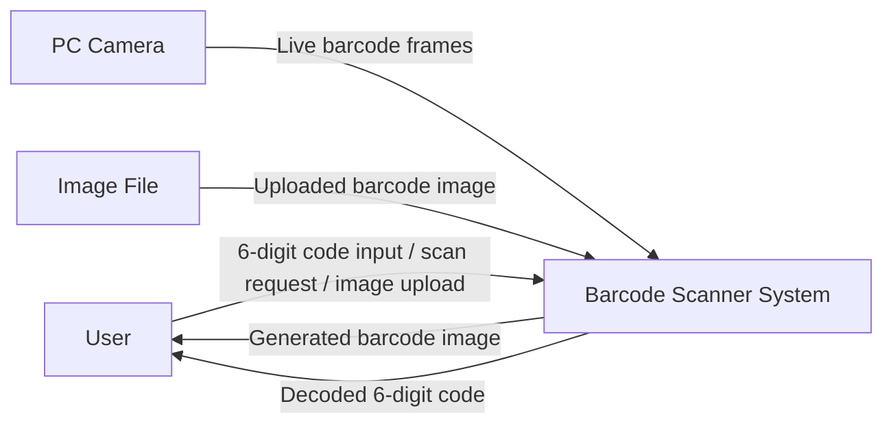
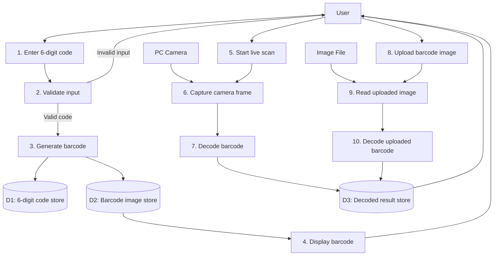
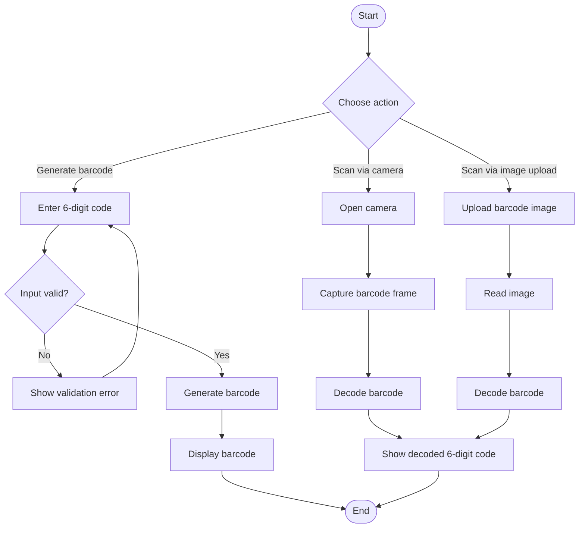

# Requirements-Phase Data Flow and Diagrams

## Context Diagram (Level 0)

```mermaid
flowchart LR
    U[User] -->|6-digit code input / scan request / image upload| S[Barcode Scanner System]
    S -->|Generated barcode image| U
    S -->|Decoded 6-digit code| U
    C[PC Camera] -->|Live barcode frames| S
    F[Image File] -->|Uploaded barcode image| S
```

## Data Flow Diagram (Level 1)

```mermaid
flowchart TD
    U[User] --> P1[1. Enter 6-digit code]
    P1 --> P2[2. Validate input]
    P2 -->|Valid code| P3[3. Generate barcode]
    P2 -->|Invalid input| U
    P3 --> D1[(D1: 6-digit code store)]
    P3 --> D2[(D2: Barcode image store)]
    D2 --> P4[4. Display barcode]
    P4 --> U

    U --> P5[5. Start live scan]
    C[PC Camera] --> P6[6. Capture camera frame]
    P5 --> P6
    P6 --> P7[7. Decode barcode]
    P7 --> D3[(D3: Decoded result store)]
    D3 --> U

    U --> P8[8. Upload barcode image]
    F[Image File] --> P9[9. Read uploaded image]
    P8 --> P9
    P9 --> P10[10. Decode uploaded barcode]
    P10 --> D3
```

## Activity Flow (Requirements View)

```mermaid
flowchart TD
    A([Start]) --> B{Choose action}
    B -->|Generate barcode| C[Enter 6-digit code]
    C --> D{Input valid?}
    D -->|No| E[Show validation error]
    E --> C
    D -->|Yes| F[Generate barcode]
    F --> G[Display barcode]
    G --> H([End])

    B -->|Scan via camera| I[Open camera]
    I --> J[Capture barcode frame]
    J --> K[Decode barcode]
    K --> L[Show decoded 6-digit code]
    L --> H

    B -->|Scan via image upload| M[Upload barcode image]
    M --> N[Read image]
    N --> O[Decode barcode]
    O --> L
```
